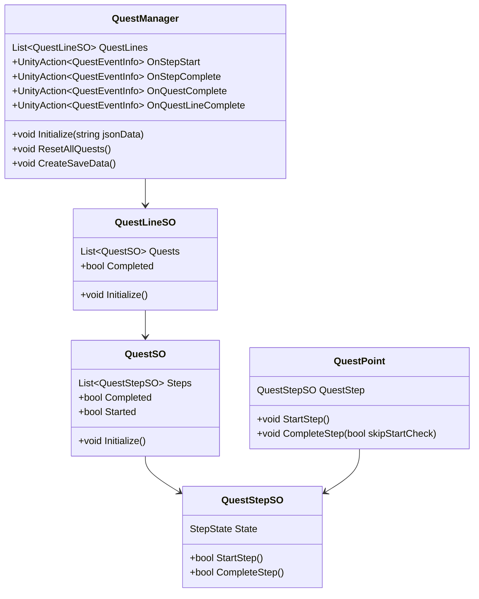
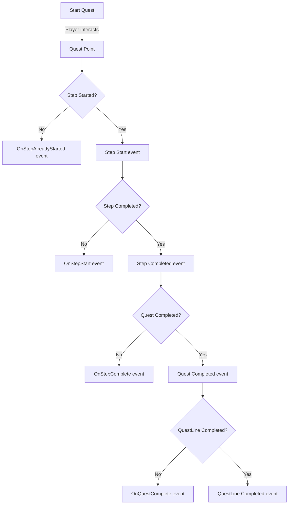

# Quest System

A customizable quest system manager enabling quest creation, quest events, and various custom interactions. This system is designed to be as abstract as possible, making it easy to integrate your own Dialogue or Inventory systems for things like rewards or quest-related actions.

## Installation

1. In Unity, open the **Package Manager**.
2. Click the `+` icon in the upper left.
3. Select `Add package from git URL...`.
4. Enter the following URL: `https://github.com/FelixBole/quest-system.git`
5. Done!

## Features

- **Quest Management**: Create and manage multiple quest lines, each containing a series of quests.
- **Event System**: Built-in event system to handle quest steps starting, completion, and progression.
- **Quest Saving/Loading**: Internal or custom save system, with support for multiple return types.
- **Flexible Integration**: Designed to easily plug into your own inventory, dialogue, or reward systems.

## Basic Setup

1. Create **Quest Lines**:
   - Right-click in the Unity project window.
   - Go to `Create > Slax > QuestSystem > QuestLine` to create a `QuestLineSO`.
   
2. Create **Quests**:
   - Right-click in the Unity project window.
   - Go to `Create > Slax > QuestSystem > Quest` to create a `QuestSO`.

3. Create **Quest Steps**:
   - Right-click in the Unity project window.
   - Go to `Create > Slax > QuestSystem > QuestStep` to create a `QuestStepSO`.
   - Assign the steps to your quests by dragging them into the quest's **Steps** list in the inspector.

4. Attach the **Quest Manager** to a GameObject in your scene:
   - Add the `QuestManager` component to a GameObject.
   - Assign your created `QuestLineSO` objects to the `QuestManager`'s list of quest lines.

5. Add a **QuestPoint** to any interactable item or character:
   - Add the `QuestPoint` component to the GameObject.
   - Assign a `QuestStepSO` to the QuestPoint to handle quest-related interactions.

## Usage Example

```csharp
public class MyQuestGiver : MonoBehaviour
{
    [SerializeField] private QuestPoint questPoint;

    public void GiveQuest()
    {
        if (!questPoint.Completed)
        {
            questPoint.StartStep();
        }
    }

    public void CompleteQuest()
    {
        if (questPoint.Started && !questPoint.Completed)
        {
            questPoint.CompleteStep();
        }
    }
}
```

## Event System

The Quest System includes several events that can be subscribed to for custom handling of quest steps:

- **OnStepStart**: Fired when a quest step starts.
- **OnStepComplete**: Fired when a quest step is completed.
- **OnQuestComplete**: Fired when all steps of a quest are completed.
- **OnQuestLineComplete**: Fired when all quests in a quest line are completed.

### Example: Subscribing to Events

```csharp
void Start()
{
    QuestManager.Instance.OnStepStart += OnQuestStepStarted;
}

void OnQuestStepStarted(QuestEventInfo eventInfo)
{
    Debug.Log($"Quest step started: {eventInfo.Step.DisplayName}");
}
```

## Saving and Loading

The system provides built-in saving and loading capabilities. You can choose between internal management or custom save systems.

### Save Example

To manually save quests:
```csharp
QuestManager.Instance.ManualSave();
```

### Load Example

To initialize the quest system with saved data:
```csharp
string savedData = // load from file or server
QuestManager.Instance.Initialize(savedData);
```

## Diagrams

### Class Diagram



### Flow Diagram


