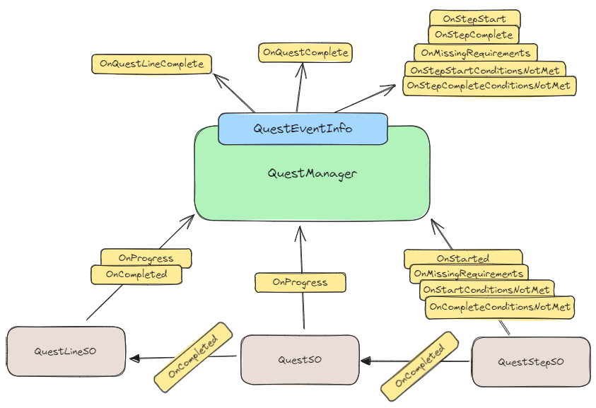
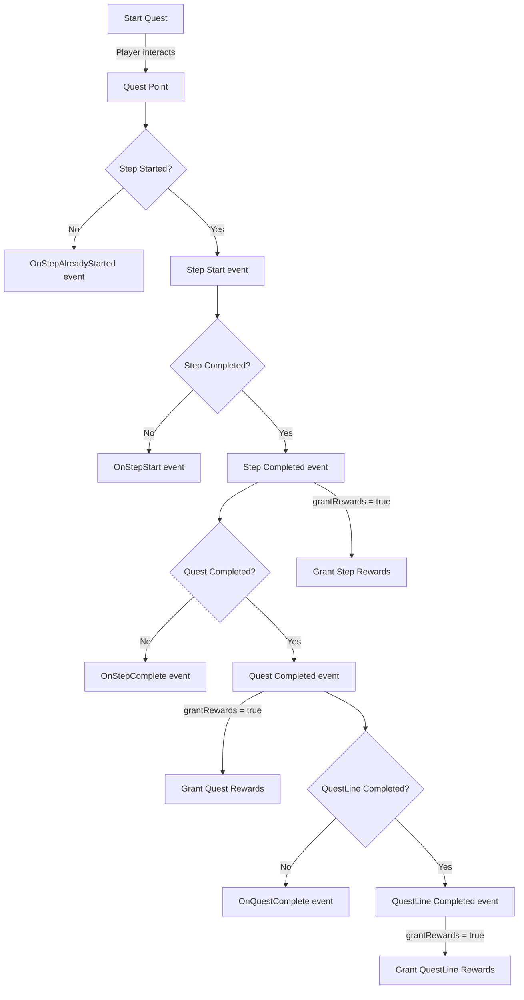

# Quest System

A customizable quest system manager enabling quest creation, quest events, and various custom interactions. This system is designed to be as abstract as possible, making it easy to integrate your own Dialogue or Inventory systems for things like rewards or quest-related actions.

## Installation

1. In Unity, open the **Package Manager**.
2. Click the `+` icon in the upper left.
3. Select `Add package from git URL...`.
4. Enter the following URL: `https://github.com/FelixBole/quest-system.git`
5. Done!

## Features

- **Quest Management**: Create and manage multiple quest lines, each containing a series of quests.
- **Event System**: Built-in event system to handle quest steps starting, completion, and progression.
- **Quest Saving/Loading**: Internal or custom save system, with support for multiple return types.
- **Flexible Integration**: Designed to easily plug into your own inventory, dialogue, or reward systems.

## Basic Setup

1. Create **Quest Lines**:
   - Right-click in the Unity project window.
   - Go to `Create > Slax > QuestSystem > QuestLine` to create a `QuestLineSO`.
2. Create **Quests**:

   - Right-click in the Unity project window.
   - Go to `Create > Slax > QuestSystem > Quest` to create a `QuestSO`.

3. Create **Quest Steps**:

   - Right-click in the Unity project window.
   - Go to `Create > Slax > QuestSystem > QuestStep` to create a `QuestStepSO`.
   - Assign the steps to your quests by dragging them into the quest's **Steps** list in the inspector.

4. Attach the **Quest Manager** to a GameObject in your scene:

   - Add the `QuestManager` component to a GameObject.
   - Assign your created `QuestLineSO` objects to the `QuestManager`'s list of quest lines.

5. Add a **QuestPoint** to any interactable item or character:
   - Add the `QuestPoint` component to the GameObject.
   - Assign a `QuestStepSO` to the QuestPoint to handle quest-related interactions.

## Usage Example

```csharp
public class MyQuestGiver : MonoBehaviour
{
    [SerializeField] private QuestPoint questPoint;

    public void GiveQuest()
    {
        if (!questPoint.Completed)
        {
            questPoint.StartStep();
        }
    }

    public void CompleteQuest()
    {
        if (questPoint.Started && !questPoint.Completed)
        {
            questPoint.CompleteStep();
        }
    }
}
```

## Setting up Conditions

The Quest System includes two types of conditions, one that is internal to the system and one that is completely customizable.

| Condition | Desc |
| --- | --- |
| QuestStepSO | Named `requirement(s)` in the system, these are quest steps that should be completed before a QuestStep can start. The system handles this by default. If you don't want requirements to be checked, simply leave the List empty. |
| IQuestCondition | An interface for you to create any kind of condition (start / complete) that can then be assigned to a QuestStepSO and that will run both when trying to start and when trying to complete. |

### Why are conditions & requirements only on the QuestStepSO

I made the decision to centralize conditional operations on the QuestStepSO and not on the others because it can be considered the way to check as well if a QuestLine or a Quest can be started / completed.

For instance, take the following example:

- My `QuestLineA` QuestLine has 2 Quests & 3 QuestSteps each
- My `QuestLineB` has 1 Quest & 2 QuestSteps
- My `QuestLineB` needs for QuestLineA's first Quest to be completed in order for the quest from QuestLineB to start.
- I can simply state the following

```C#
// If my last step of my first quest from QuestLineA is completed, then the quest is completed

var questStep = QuestLineA.GetFirstQuest().GetLastStep(); // The last step in question

// If we set this last step to be a requirement for QuestLineB to start, we can set it as the
// very first requirement of the first step of the questline
QuestLineB.Quests.GetFirstStep().SetRequirements(new List<QuestStepSO>(questStep));
```

> Of course this is easier to do by drag & dropping elements around in the inspector. This was to show how it's possible through scripting, as shown in this example.

## Event System

The Quest System includes several events that can be subscribed to for custom handling of quest steps, quests & questlines.



Each _layer_ has its own set of public Events that any subscriber can listen to. But the key takeaway here is that the main events are relayed by the QuestManager by reconstructing them into a `QuestEventInfo` struct to have a centralized event relayer.

> You don't need to only listen to QuestManager events, feel free to listen to QuestStepSO / QuestSO / QuestLineSO events directly if you feel like it's better for your game. This is just how events are relayed in the Quest System itself.

### QuestManager Events

The QuestManager can be seen as an event relayer in which it provides the QuestEventInfo struct to every event it fires. Most events fired allow the QuestEventInfo to contain the following information.

**QuestEventInfo Struct** | Property | Description | | -------- | -------- | | QuestLine | The QuestLine concerned by the event. | | Quest | The Quest concerned by the event. | | Step | The Quest Step concerned by the event. | | IsQuestStart | If it is an event for a new quest. | | IsQuestLineStart | If it is an event for a new quest line. | | ConditionType | Only included on an event about missing requirements / conditions, sets what type of condition failed. | | Conditions | On a conditions failed event, this will not be empty and contain the List of IQuestCondition that failed. | | Requirements | On a missing requirements event, will contain the list of QuestStepSO requirements that were not completed. |

#### Events providing QuestEventInfo

| Event | Description |
| --- | --- |
| `OnStepStart` | Fired when a step is started. The `QuestEventInfo` will hold the appropriate info to know if it is also a Quest start, a QuestLine start or simply a quest progress. |
| `OnStepComplete` | Fired when a step is completed but the quest is not yet completed. |
| `OnQuestComplete` | Fired when a step is completed, completing the associated Quest with it, but that doesn't conclude the QuestLine yet. |
| `OnQuestLineComplete` | Fired when a step is completed, completing the associated Quest with it and concluding the QuestLine associated. |
| `OnMissingRequirements` | Fired when a step attempted to start but there are some missing step requirements before it can start. The `QuestEventInfo` will hold information about which requirements are needed. |
| `OnStepStartConditionsNotMet` | Fired when the custom conditions that need to run in order to validate if a quest step can start fails. The `QuestEventInfo` will hold information about which conditions have failed. |
| `OnStepCompleteConditionsNotMet` | Fired when the custom conditions that need to run in order to validate if a quest step can complete itself fails. The `QuestEventInfo` will hold information about which conditions have failed. |

### QuestLineSO Events

| Event | Description |
| --- | --- |
| `OnCompleted` | Fired when a quest has been completed and it was the last quest of a questline, meaning the questline can be completed. This event is picked up by the `QuestManager` to send a `OnQuestLineComplete` event. |
| `OnProgress` | Fired when a quest has been completed but the QuestLine is not over yet. The `QuestManager` will pick up this event to send an `OnQuestComplete` event. |

### QuestSO Events

| Event | Description |
| --- | --- |
| `OnCompleted` | Fired when a quest step which was the last step of a quest is completed, completing the quest as well. This event is picked up by the `QuestLineSO` in order for it to determine if it should send its `OnCompleted` or `OnProgress` event. |
| `OnProgress` | Fired when a quest step was completed, which did not complete the quest itself. This event is picked up directly by the `QuestManager` for it to send a `OnStepComplete` event. |

### QuestStepSO Events

| Event | Description |
| --- | --- |
| `OnStarted` | Event fired when the step start attempt is successful. This is picked up by the `QuestManager` directly for it to send his `OnStepStart` event. |
| `OnMissingRequirements` | Fired when there was an attempt to start the step but some steps marked as requirements were not completed. This event provides the missing requirements. This event is picked up by the `QuestManager` to send its `OnMissingRequirements` event. |
| `OnStartConditionsNotMet` | Event fired when there is an attempt to start the step but some custom `IQuestConditions` were not met. The event provides the list of failed conditions and is picked up by the `QuestManager` to fire the `OnStepStartConditionsNotMet` event. |
| `OnStepCompleteConditionsNotMet` | Event fired when there is an attempt to complete the step but some custom conditions to validate the completion where not met. This event is picked up by the `QuestManager` to send the `OnStepCompleteConditionsNotMet` event. |

### Example: Subscribing to Events

```csharp
void Start()
{
    QuestManager.Instance.OnStepStart += OnQuestStepStarted;
}

void OnQuestStepStarted(QuestEventInfo eventInfo)
{
    Debug.Log($"Quest step started: {eventInfo.Step.DisplayName}");
}
```

## Saving and Loading

The system provides built-in saving and loading capabilities. You can choose between internal management or custom save systems.

### Save Example

To manually save quests:

```csharp
QuestManager.Instance.ManualSave();
```

### Load Example

To initialize the quest system with saved data:

```csharp
string savedData = // load from file or server
QuestManager.Instance.Initialize(savedData);
```

## Reward System

You can optionnally plug into the Reward system managed by the QuestManager. In order to activate it, you need to do 2 things:

- Create `IQuestReward`s for the rewards you want to use and assign them to either steps, quests or quest lines.
- Toggle the `QuestManager`'s `\_grantRewards` boolean to true, either from the inspector or through code using

```C#
questManager.SetGrantRewards(true);
```

> If the QuestManager is not set to grant rewards automatically, you are still able to access the Rewards you set on the step, quest & questlines either directly from the objects themselves if you have reference to them, or from the objects within the QuestEventInfo struct provided by a [QuestManager event](#questmanager-events).

## Diagrams

### Flow Diagram


